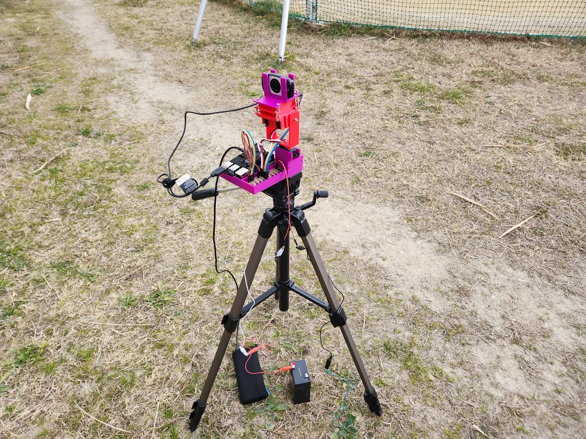

# Multiple Launch Rocket Firework System 多連装ロケット花火システム

この作品は、東京大学工学部電子情報工学科・電気電子工学科の講義「電子情報機器学」（通称BDM）で実装したものです。
ラズベリーパイとiPadを使って遠隔操作で8発までロケット花火を打つことができます。

ラズベリーパイでWebサーバを動かし、カメラの映像をリアルタイムで配信します。
iPadなどの端末からこの映像を見ながら、ロケット花火の向きを操作できるようにしています。
指示を受け取ったラズベリーパイは、サーボモータやニクロム線を制御し、花火を発射します。
